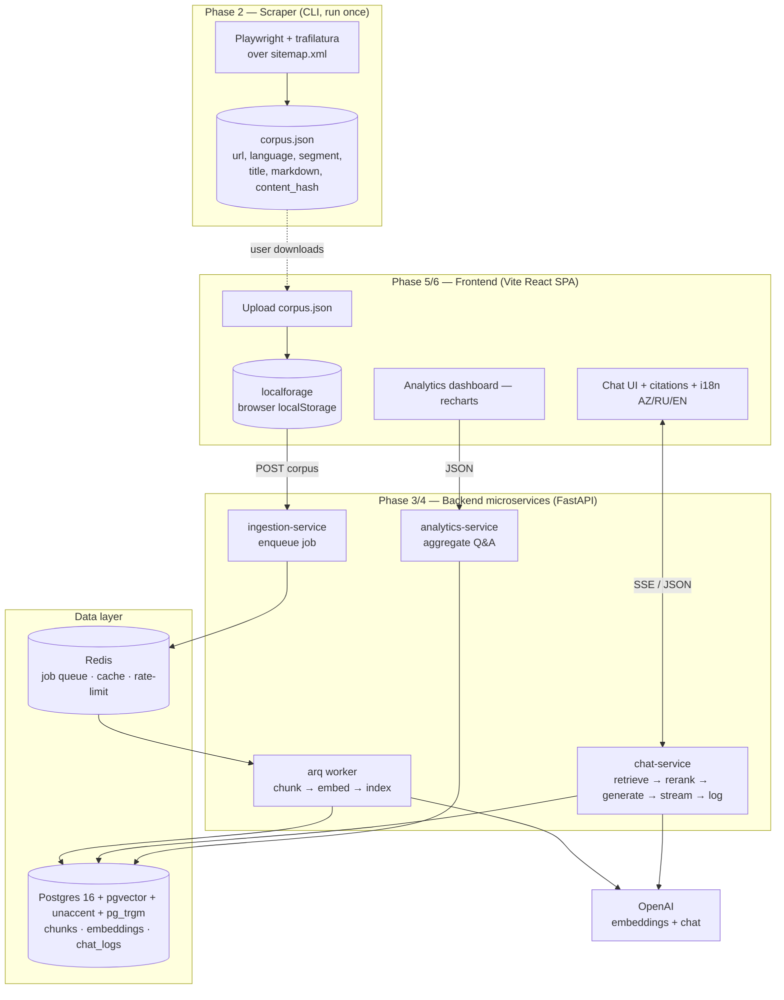

# ABB RAG Platform — Master Plan

A production-grade Retrieval-Augmented Generation (RAG) platform that scrapes ABB
Bank's official website, indexes its content into a vector database, answers user
questions through a grounded conversational interface, persists every interaction,
and visualizes usage analytics — all containerized for one-command deployment.

This is the **master plan**. It owns the *why*: vision, locked decisions,
architecture, repository layout, the phase index, and the requirement
traceability matrix. Each phase has its own plan file (`01`–`08`) carrying the
*how* in the `Decisions → Plan → Breakdown` format.

---

## 1. Source Requirements (from the assessment brief)

1. **Web Scraping** — script to parse the official ABB website and extract all textual content.
2. **Web Application**
   - a. **Data Upload** — upload extracted data, store in the browser's local storage.
   - b. **OpenAI Integration** — backend service interacting with an OpenAI LLM; format extracted data into a vector database format (framework of choice).
   - c. **Conversational Interface** — chat UI; answers within ABB context; **microservice architecture** for question handling and response generation using **JSON**; store **questions, answers, timestamps** in a database.
3. **Data Visualization** — charting library to visualize stored Q&A and user-interaction insights.
4. **Containerization** — package app + dependencies into Docker image(s).

**Evaluation criteria:** Functionality, Code Quality, Efficiency, Design, Documentation.
**Timeline:** one week. **Output:** code shared with HR + live walkthrough/demo with the ABB team.

---

## 2. Locked Decisions

| # | Decision | Choice | Rationale |
| - | -------- | ------ | --------- |
| 1 | Backend stack | **Python + FastAPI + LangChain** | Matches ABB's own AI/ML stack; deepest RAG ecosystem (native rerankers, RAGAS); async-first web framework. |
| 2 | Frontend stack | **Vite + React 19 + TS + Tailwind + shadcn/ui + recharts + localforage + TanStack Query** | Mirrors `timeback-frontend` conventions; clean SPA↔API split reinforces the microservice story. |
| 2a | Streaming transport | **Plain SSE** (`sse-starlette` ↔ `@microsoft/fetch-event-source`) | Full control, zero framework coupling. |
| 2b | FE/BE type safety | **OpenAPI → generated Zod schemas** (`orval`/`openapi-zod-client`) + runtime `.parse()` at the API boundary; TS types via `z.infer` | FastAPI/Pydantic is the single source of truth; frontend gets **both** compile-time types **and** runtime validation with zero manual drift. Bad/stale backend data fails loudly at the boundary instead of silently corrupting state. |
| 3 | Service granularity | **3 services: chat, ingestion, analytics** + Postgres + Redis | Genuine boundaries with distinct runtime profiles; right-sized for one week. **`chat-service` is explicitly THE brief-mandated "question-handling & response-generation microservice"** (JSON contract `ChatRequest→ChatResponse`); the other two are sibling services. |
| 3a | Ingestion execution | **Async via Redis-backed worker** (`arq`) | Embedding a full site is long-running; endpoint returns `job_id`, frontend polls progress. Redis also serves cache + rate-limit. |
| 4 | Vector store | **Postgres 16 + pgvector** (HNSW + `tsvector`/GIN) | One datastore for vectors *and* chat logs; hybrid search in a single query; bank-grade ACID/audit. |
| 5 | Reranking | **Local BGE cross-encoder** (`BAAI/bge-reranker-v2-m3`) via LangChain `ContextualCompressionRetriever` | Highest-ROI quality lever; self-hosted (content never leaves infra); OpenAI stays the only external vendor. |
| 6 | Scraper | **Playwright (headless) + trafilatura (+ lxml fallback)** | ABB is a Next.js app rendering content *and* listing links via JS — a headless browser over `sitemap.xml` is required for full coverage (incl. requisites/card tables); trafilatura extracts, lxml recovers structured tables. (Scrapy HTTP was tried and removed: it only saw ~344 nav pages.) |
| 7 | Embedding model | **`text-embedding-3-large`** | Top multilingual retrieval quality (AZ/EN/RU); cost trivial for one site. |
| 7a | Chat models | **`gpt-4o`** primary + **`gpt-4o-mini`** auxiliary, **env-driven** | Flagship for answers, mini for query-rewrite/summary/guardrail; `gpt-5` is a one-line env switch. |
| 8 | Feature scope | Baseline + **multilang AZ/RU/EN (all first-class), RAGAS eval, conversation memory, rate limiting, CI** | Maximizes impact per hour against scored criteria; finishable in a week. |
| 8a | Out of scope | Observability (Sentry/OTel), cloud deploy, auth, thumbs-up/down feedback, DB backups, Alembic migrations, PII redaction | Deferred for demo scope; documented as production gaps. `init.sql` used instead of migrations. |
| 8b | Production hardening (in) | Equal AZ/RU/EN retrieval, prompt-injection defense, OpenAI retry on all calls, context token budget, persist-on-disconnect, CORS lockdown | Folded in from the production audit — the difference between a demo toy and production-grade. |
| 9 | Plan format | **Master + per-phase files** in `.plans/` | Each phase independently executable by a subagent; matches `ref_plan` style. |

**Baseline features (always in):** source citations with deep links, on-topic guardrail + prompt-injection defense, SSE streaming, hybrid search + reranking.

---

## 3. Architecture



**Request flow (chat):** question → on-topic guardrail + injection check (`gpt-4o-mini`) → optional query rewrite using memory → hybrid retrieve (dense multilingual pgvector + sparse `simple`+`unaccent`+`pg_trgm`, RRF fusion, equal AZ/RU/EN) → BGE rerank → top-k context (token-budgeted) → `gpt-4o` generation with citations (streamed via SSE, all OpenAI calls retry-wrapped) → persist Q/A/timestamp/citations (in `finally`, survives disconnect) → return.

---

## 4. Repository Layout

```
abb-rag/
├── .plans/                      # this planning set
├── README.md                    # top-level: quickstart, architecture, demo script
├── docker-compose.yml           # postgres, redis, ingestion, worker, chat, analytics, web
├── .env.example                 # OPENAI_API_KEY, model names, DB/Redis URLs
├── packages/
│   └── contracts/               # shared Pydantic models + JSON Schema (corpus, chat, analytics)
├── apps/
│   ├── scraper/                 # Scrapy project → corpus.json
│   ├── ingestion/               # FastAPI: upload + job status; arq worker
│   ├── chat/                    # FastAPI: SSE chat, retrieval, rerank, persistence
│   ├── analytics/               # FastAPI: aggregation endpoints
│   └── web/                     # Vite React SPA
├── libs/
│   └── rag/                     # shared Python RAG lib: chunking, embeddings, retrievers, rerank, db
├── infra/
│   ├── postgres/init.sql        # pgvector extension, schema, indexes
│   └── ci/                      # GitHub Actions workflows
└── eval/                        # RAGAS harness + golden question set
```

`libs/rag` is imported by `ingestion`, `chat`, and `analytics` so the retrieval/embedding logic has one source of truth. `packages/contracts` is the cross-service + cross-language schema authority.

---

## 5. Phase Index

| Phase | File | Outcome |
| ----- | ---- | ------- |
| P1 Foundations | `01-foundations.md` | Monorepo, tooling, shared contracts, Docker + DB skeleton, CI scaffold |
| P2 Scraper | `02-scraper.md` | `corpus.json` from abb-bank.az (AZ/EN/RU, segment-tagged) |
| P3 Indexing & RAG core | `03-indexing-rag-core.md` | `libs/rag`: chunk → embed → pgvector; hybrid retrieve + BGE rerank |
| P4 Backend API | `04-backend-api.md` | chat/ingestion/analytics services, SSE, async worker, persistence, guardrail, memory |
| P5 Frontend | `05-frontend.md` | Upload→localforage, streaming chat + citations, i18n (AZ/RU/EN) |
| P6 Visualization | `06-visualization.md` | analytics-service + recharts dashboard |
| P7 Containerization | `07-containerization.md` | Dockerfiles, compose, Redis rate-limit, CI complete |
| P8 Eval & Docs | `08-eval-and-docs.md` | RAGAS harness, READMEs, demo script |

**Suggested execution order:** P1 → P2 ∥ P3 → P4 → P5 ∥ P6 → P7 → P8.
(P2 and P3 can run in parallel after P1; P5 and P6 can run in parallel after P4.)
**Subject to the Day-2 de-risking gate in §6a** — a runnable thin slice + green `docker compose up` precede any advanced layer.

---

## 6. Requirement → Phase Traceability

| Brief requirement | Phase(s) | Verification |
| ----------------- | -------- | ------------ |
| 1. Web scraping | P2 | `corpus.json` produced; pages across AZ/EN/RU + all segments |
| 2a. Upload → localStorage | P5 | Corpus persisted via localforage; chat gated on "data uploaded" |
| 2b. OpenAI + vector DB format | P3, P4 | pgvector populated; embeddings via `text-embedding-3-large` |
| 2c. Conversational interface (ABB context) | P4, P5 | Grounded answers + citations; off-topic declined |
| 2c. Microservice architecture | P4, P7 | 3 deployable services; compose topology |
| 2c. JSON format | P3, P4 | Typed JSON contracts (Pydantic + OpenAPI) |
| 2c. Store Q/A/timestamps | P4 | `chat_logs` rows persisted with timestamps + citations |
| 3. Visualization | P6 | recharts dashboard backed by analytics-service |
| 4. Containerization | P7 | `docker compose up` runs full stack |
| Efficiency | P3, P4, P7 | Async ingestion, Redis cache, streaming, rate limiting |
| Code Quality | P1, P8 | Lint/type/test in CI; typed contracts |
| Design | P5, P6 | Polished shadcn UI, streaming UX, i18n |
| Documentation | P8 | Per-service READMEs, demo script, this plan set |
| Extra: multilang / eval / memory | P5 / P8 / P4 | Feature-specific checks per phase |
| Hardening: injection / retry / token-budget / disconnect / equal-lang | P3, P4 | Security + resilience tests per phase |

---

## 6a. Execution Discipline — De-risking Gate

The ambition of this plan is deliberate (state-of-the-art, production-grade), so a
hard discipline rule neutralizes the one real risk: *not finishing / reviewer
can't run it.*

- **Day-2 gate (must pass before any advanced layer):**
  1. A **working end-to-end thin slice**: ingest a tiny corpus → single retrieval → one (non-streamed) grounded answer.
  2. **`docker compose up` comes up green** on a clean machine.
  Until both hold, no work begins on rerank, RAGAS, i18n, memory, or analytics.

- **Additive, individually droppable layers:** every advanced feature is built so
  it can be removed without breaking the core path, and each has an off switch or
  is independent:
  | Layer | Drop mechanism if time runs out |
  | ----- | ------------------------------- |
  | Reranking | `RERANK_ENABLED=false` (hybrid search still answers) |
  | RAGAS eval | independent `eval/` package — omit without touching runtime |
  | i18n AZ/RU/EN | ship EN-complete; AZ/RU are additive locale files |
  | Conversation memory | flag off → single-turn still works |
  | Async worker (arq) | fall back to FastAPI `BackgroundTasks` |
  | Analytics dashboard | chat path is independent of it |

- **Green-at-all-times:** `docker compose up` must stay runnable from Day 2 to the
  end; CI keeps lint/type/test green continuously.

This preserves "maximum potential" while guaranteeing a demoable, runnable product
at every point.

## 7. Risks & Mitigations

| Risk | Mitigation |
| ---- | ---------- |
| ABB site blocks/throttles crawl | robots.txt obedience + custom UA + bounded concurrency; ship a committed `corpus.sample.json` so the demo never depends on a live crawl. |
| OpenAI key lacks `gpt-5`/model access | Env-driven models; default `gpt-4o`/`4o-mini`; verify access in P1. |
| BGE reranker bloats image / slow on CPU | Pin a quantized/small reranker; lazy-load; document a toggle to skip rerank. |
| One-week scope creep | Tiered scope (Decision 8); cloud/observability/auth explicitly deferred. |
| localStorage size limits for large corpus | Store corpus metadata + chunked payload in localforage (IndexedDB backend, not the 5MB localStorage cap). |
| Multilingual answer/citation mismatch | Tag language at chunk level; filter/boost retrieval by UI language; respond in question language. |
| Azerbaijani has no Postgres full-text config | Uniform `simple`+`unaccent`+`pg_trgm` sparse search for **all** languages (no stemmer privilege) + multilingual dense vectors → genuinely equal AZ/RU/EN. |
| Prompt injection (user input or scraped content) | Context delimited + labeled untrusted; system prompt never followed from context; DOMPurify on render; refusal rule. |
| OpenAI rate-limit/timeout mid-chat | Retry+backoff on all OpenAI calls; typed user-facing error if exhausted. |
| Client disconnects mid-stream | Persist partial answer + metadata in SSE `finally` block. |

---

## 8. Definition of Done

- `docker compose up` brings up Postgres, Redis, all three services, and the web app.
- User can upload `corpus.json`, see ingestion progress, then chat with grounded, cited answers.
- Off-topic and prompt-injection questions are politely declined.
- Q/A/timestamps/citations persist (even on mid-stream disconnect); dashboard renders live insights.
- AZ/RU/EN all first-class and switchable; conversation memory works across turns.
- RAGAS harness produces faithfulness/relevancy/context-precision scores on the golden set.
- CI runs lint + type-check + tests green.
- READMEs + demo script complete.
- Day-2 de-risking gate (§6a) was met and `docker compose up` stayed green throughout.
