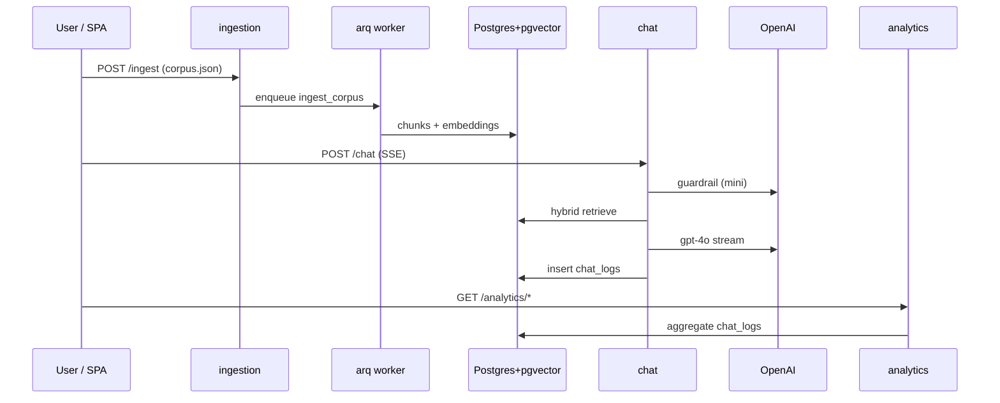

# Architecture

Production RAG platform for ABB Bank: scrape → ingest → retrieve → generate →
persist → visualize. All backend services share `libs/rag` and Pydantic contracts
from `packages/contracts`.

## Service boundaries

| Service | Port | Responsibility |
| --- | --- | --- |
| `ingestion` | 8001 | Accept corpus upload, enqueue arq job |
| `worker` | — | Chunk, embed, upsert into Postgres |
| `chat` | 8002 | Guardrail → retrieve → SSE answer → persist |
| `analytics` | 8003 | Read-only aggregates over `chat_logs` |
| `web` | 5173 / 80 | Upload, streaming chat, dashboard (i18n AZ/EN/RU) |
| `scraper` | CLI | Playwright crawl → `corpus.json` |

Redis backs the arq queue, ingestion progress hashes, analytics response cache,
and **POST-only** per-IP rate limiting (`RATE_LIMIT_PER_MINUTE`, default 10).

## Data flow



## Retrieval pipeline (`libs/rag`)

1. **Language** — query language from chat auto-detect (`py3langid`) or explicit
   hint; retrieval uses per-question language with cross-language fallback when
   the primary pool under-fills.
2. **Hybrid search** — pgvector cosine (HNSW) + `pg_trgm` keyword, fused with
   RRF; optional BGE cross-encoder rerank in the chat container.
3. **Context assembly** — top chunks packed to a token budget before generation.

## Chat request path

```
question
  → auto_language(question, ui_hint)     # per-question, not UI-only
  → classify (gpt-4o-mini guardrail)
  → [declined] off_topic_refusal
  → [on_topic] retrieve → build_context → stream_answer (SSE)
  → insert_chat_log (status, citations, latency, tokens)
```

Guardrail verdicts: `on_topic`, `off_topic`, `injection`. Unrecognized model
labels fail closed to `off_topic`.

## Schema (Postgres)

Applied once via `infra/postgres/init.sql` on volume creation:

- `documents`, `chunks` — corpus storage + HNSW embedding index
- `chat_logs` — every turn (question, answer, status, citations JSON, tokens,
  latency, retrieved chunk ids)

## Frontend

Vite + React 19 SPA. Hand-written Zod schemas mirror `packages/contracts` (no
orval). TanStack Query for API calls; localforage for corpus upload staging;
recharts dashboard with UTC axis labels and zero-filled volume buckets.

## Evaluation (`eval/`)

`uv run abb-eval` replays `golden_set.json` through the real guardrail +
retrieval + generation stack and scores RAGAS metrics plus guardrail
precision/recall. See [`eval/README.md`](eval/README.md).

## Deployment

`docker compose up --build` — seven services, health checks, graceful worker
shutdown, optional reranker prebake. CI runs lint, type-check, pytest (with
service containers), frontend tests, and `docker compose build`.

## Key environment variables

See [`.env.example`](.env.example): `OPENAI_API_KEY`, `DATABASE_URL`,
`REDIS_URL`, embedding/chat models, `RERANK_ENABLED`, `RATE_LIMIT_PER_MINUTE`,
`CHAT_MEMORY_ENABLED`, CORS origins.
